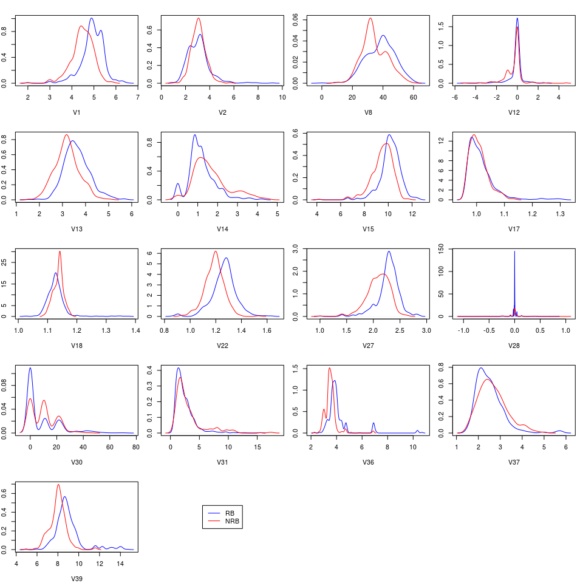
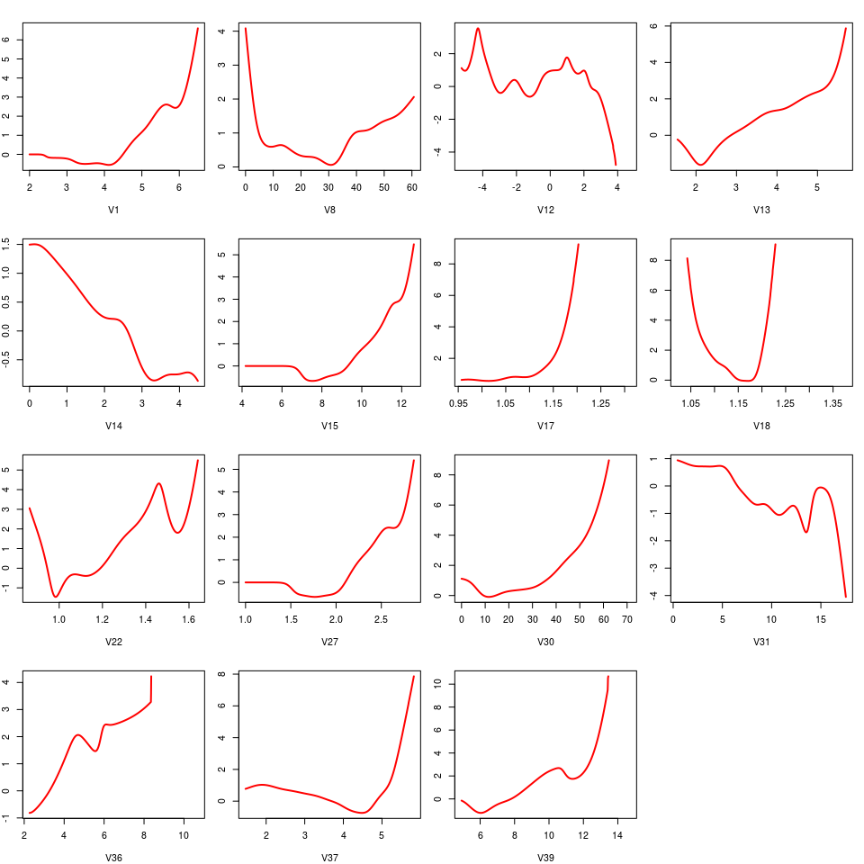
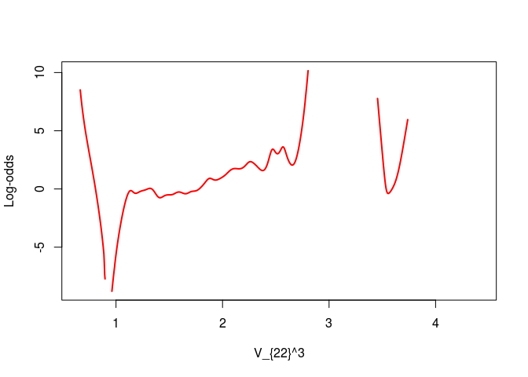
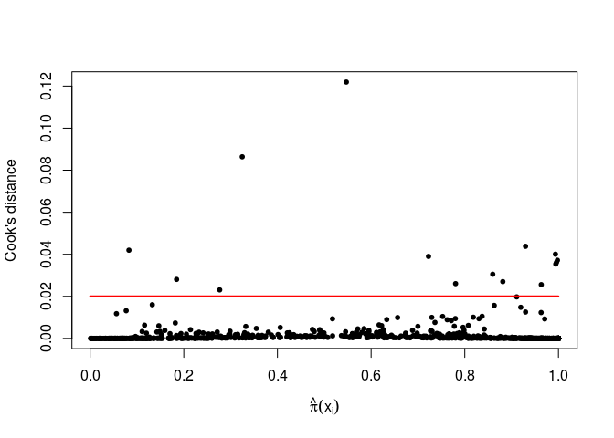
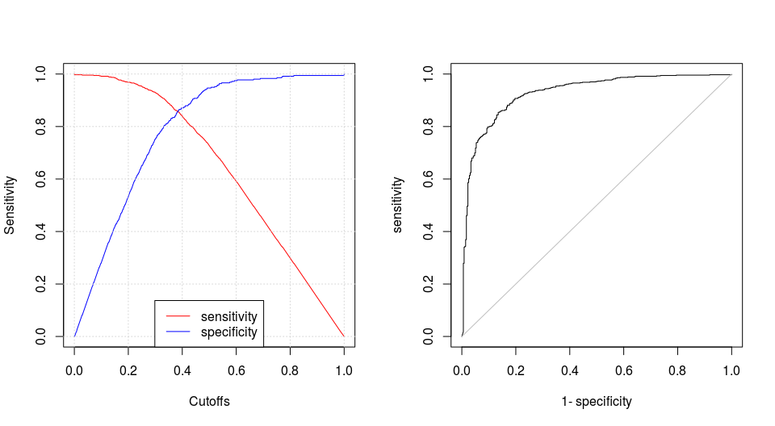

advanced logistic regression 

Постановка задачи
==================

1055 химических молекул описаны с помощью 41 признака (число атомов кислорода, нитратных групп, донорных связей с водородом, потенциал ионизации и т.д.); 355 из них биоразложимы. Какие свойства молекул влияют на их биоразлагаемость?

Решение
========

Загрузка данных

``` r
data = read.csv("dataset.csv", sep = ";", header = F, dec=".")
data["V42"] = as.integer(unlist(data["V42"]))
data["V42"][unlist(data["V42"])==2,] = 0
data["V42"] = as.integer(unlist(data["V42"]))
head(data)
```

    ##      V1     V2 V3 V4 V5 V6 V7   V8 V9 V10 V11    V12   V13   V14   V15 V16
    ## 1 3.919 2.6909  0  0  0  0  0 31.4  2   0   0  0.000 3.106 2.550 9.002   0
    ## 2 4.170 2.1144  0  0  0  0  0 30.8  1   1   0  0.000 2.461 1.393 8.723   1
    ## 3 3.932 3.2512  0  0  0  0  0 26.7  2   4   0  0.000 3.279 2.585 9.110   0
    ## 4 3.000 2.7098  0  0  0  0  0 20.0  0   2   0  0.000 2.100 0.918 6.594   0
    ## 5 4.236 3.3944  0  0  0  0  0 29.4  2   4   0 -0.271 3.449 2.753 9.528   2
    ## 6 4.236 3.4286  0  0  0  0  0 28.6  2   4   0 -0.275 3.313 2.522 9.383   1
    ##     V17   V18 V19 V20 V21   V22 V23 V24 V25 V26   V27    V28 V29    V30
    ## 1 0.960 1.142   0   0   0 1.201   0   0   0   0 1.932  0.011   0  0.000
    ## 2 0.989 1.144   0   0   0 1.104   1   0   0   0 2.214 -0.204   0  0.000
    ## 3 1.009 1.152   0   0   0 1.092   0   0   0   0 1.942 -0.008   0  0.000
    ## 4 1.108 1.167   0   0   0 1.024   0   0   0   0 1.414  1.073   0  8.361
    ## 5 1.004 1.147   0   0   0 1.137   0   0   0   0 1.985 -0.002   0 10.348
    ## 6 1.014 1.149   0   0   0 1.119   0   0   0   0 1.980 -0.008   0 10.276
    ##     V31 V32 V33 V34 V35   V36   V37 V38   V39 V40 V41 V42
    ## 1 4.489   0   0   0   0 2.949 1.591   0 7.253   0   0   0
    ## 2 1.542   0   0   0   0 3.315 1.967   0 7.257   0   0   0
    ## 3 4.891   0   0   0   1 3.076 2.417   0 7.601   0   0   0
    ## 4 1.333   0   0   0   1 3.046 5.000   0 6.690   0   0   0
    ## 5 5.588   0   0   0   0 3.351 2.405   0 8.003   0   0   0
    ## 6 4.746   0   0   0   0 3.351 2.556   0 7.904   0   0   0

В данной задаче отклик бинарный. Пусть свойство разложимости молекулы *y* имеет распределение Бернулли. Тогда выборка *Y* распределена по биномиальному закону. Для решение подобного рода задач используются обобщённые линейные модели с биномиальным распределением.

Посмотрим на распределения непрерывных признаков в классах:



Линейной разделимости по отдельным признакам нет. Для логистической регрессии это хорошо: коэффициенты модели не будут бесконечно возрастать при обучении, и регуляризация Фирта не требуется.

Модель 1
========

Построим самую первую модель наших ииследований *m*<sub>1</sub>:

``` r
m1 = glm(V42 ~ ., binomial, data)
summary(m1)
```

    ## 
    ## Call:
    ## glm(formula = V42 ~ ., family = binomial, data = data)
    ## 
    ## Deviance Residuals: 
    ##     Min       1Q   Median       3Q      Max  
    ## -3.3511  -0.3692   0.0563   0.3769   2.3668  
    ## 
    ## Coefficients:
    ##               Estimate Std. Error z value Pr(>|z|)    
    ## (Intercept)  -40.41882   47.62761  -0.849 0.396080    
    ## V1             2.59522    1.17762   2.204 0.027540 *  
    ## V2             1.04401    0.30237   3.453 0.000555 ***
    ## V3             0.59315    0.54800   1.082 0.279071    
    ## V4            -1.62559    0.77931  -2.086 0.036984 *  
    ## V5             0.26586    0.16562   1.605 0.108433    
    ## V6             2.12107    0.57190   3.709 0.000208 ***
    ## V7             1.03729    0.23045   4.501 6.76e-06 ***
    ## V8            -0.10970    0.06504  -1.687 0.091666 .  
    ## V9            -0.11332    0.15009  -0.755 0.450231    
    ## V10           -0.30704    0.20096  -1.528 0.126552    
    ## V11           -0.13747    0.12039  -1.142 0.253532    
    ## V12           -0.40314    0.22736  -1.773 0.076201 .  
    ## V13            3.63669    1.74711   2.082 0.037384 *  
    ## V14           -1.10615    0.35306  -3.133 0.001730 ** 
    ## V15           -3.49936    1.13539  -3.082 0.002056 ** 
    ## V16            0.03151    0.06852   0.460 0.645614    
    ## V17            1.13715   16.44781   0.069 0.944880    
    ## V18           33.71005   33.70782   1.000 0.317279    
    ## V19           18.55224 1563.12957   0.012 0.990530    
    ## V20            2.02377    0.87807   2.305 0.021178 *  
    ## V21           11.03741  609.87527   0.018 0.985561    
    ## V22            2.43838    4.85719   0.502 0.615657    
    ## V23            0.04337    0.24737   0.175 0.860822    
    ## V24           -3.69933    1.98433  -1.864 0.062284 .  
    ## V25            0.65167    0.69507   0.938 0.348469    
    ## V26           -1.76781    0.90667  -1.950 0.051201 .  
    ## V27            3.38045    3.04366   1.111 0.266718    
    ## V28            0.83931    0.73117   1.148 0.251012    
    ## V29            2.00940    1.61478   1.244 0.213361    
    ## V30           -0.05301    0.02390  -2.218 0.026535 *  
    ## V31            0.00786    0.16296   0.048 0.961532    
    ## V32            1.56441    0.40983   3.817 0.000135 ***
    ## V33           -0.12844    0.26098  -0.492 0.622621    
    ## V34            0.41024    0.14527   2.824 0.004744 ** 
    ## V35           -0.32442    0.16172  -2.006 0.044850 *  
    ## V36           -1.37400    1.16443  -1.180 0.238010    
    ## V37           -1.78467    0.88763  -2.011 0.044367 *  
    ## V38            0.49170    0.45878   1.072 0.283835    
    ## V39            1.47417    1.40837   1.047 0.295228    
    ## V40           -1.14377    0.44691  -2.559 0.010489 *  
    ## V41           -0.13840    0.73528  -0.188 0.850701    
    ## ---
    ## Signif. codes:  0 '***' 0.001 '**' 0.01 '*' 0.05 '.' 0.1 ' ' 1
    ## 
    ## (Dispersion parameter for binomial family taken to be 1)
    ## 
    ##     Null deviance: 1348.97  on 1054  degrees of freedom
    ## Residual deviance:  594.41  on 1013  degrees of freedom
    ## AIC: 678.41
    ## 
    ## Number of Fisher Scoring iterations: 17

Модель 2
========

Для предварительного отбора признаков построим одномерные модели по каждому фактору и оценим их значимость:

``` r
m1 = glm(V42~1, binomial, data)
a1 = add1(m1, names(data), test="LRT")
a1
```

    ## Single term additions
    ## 
    ## Model:
    ## V42 ~ 1
    ##        Df Deviance    AIC     LRT  Pr(>Chi)    
    ## <none>      1349.0 1351.0                      
    ## V1      1   1171.7 1175.7 177.258 < 2.2e-16 ***
    ## V2      1   1349.0 1353.0   0.004 0.9507728    
    ## V3      1   1177.7 1181.7 171.283 < 2.2e-16 ***
    ## V4      1   1332.5 1336.5  16.506 4.849e-05 ***
    ## V5      1   1233.6 1237.6 115.329 < 2.2e-16 ***
    ## V6      1   1275.5 1279.5  73.471 < 2.2e-16 ***
    ## V7      1   1179.3 1183.3 169.697 < 2.2e-16 ***
    ## V8      1   1305.3 1309.3  43.664 3.899e-11 ***
    ## V9      1   1345.4 1349.4   3.568 0.0589036 .  
    ## V10     1   1316.5 1320.5  32.441 1.228e-08 ***
    ## V11     1   1234.6 1238.6 114.390 < 2.2e-16 ***
    ## V12     1   1335.8 1339.8  13.128 0.0002909 ***
    ## V13     1   1211.0 1215.0 137.976 < 2.2e-16 ***
    ## V14     1   1269.6 1273.6  79.358 < 2.2e-16 ***
    ## V15     1   1218.3 1222.3 130.695 < 2.2e-16 ***
    ## V16     1   1349.0 1353.0   0.009 0.9254482    
    ## V17     1   1339.4 1343.4   9.536 0.0020149 ** 
    ## V18     1   1331.1 1335.1  17.887 2.344e-05 ***
    ## V19     1   1342.3 1346.3   6.617 0.0100986 *  
    ## V20     1   1309.6 1313.6  39.362 3.521e-10 ***
    ## V21     1   1330.6 1334.6  18.350 1.838e-05 ***
    ## V22     1   1188.1 1192.1 160.828 < 2.2e-16 ***
    ## V23     1   1223.9 1227.9 125.093 < 2.2e-16 ***
    ## V24     1   1331.4 1335.4  17.560 2.784e-05 ***
    ## V25     1   1263.2 1267.2  85.821 < 2.2e-16 ***
    ## V26     1   1336.3 1340.3  12.681 0.0003694 ***
    ## V27     1   1178.9 1182.9 170.033 < 2.2e-16 ***
    ## V28     1   1348.3 1352.3   0.662 0.4157733    
    ## V29     1   1337.4 1341.4  11.582 0.0006659 ***
    ## V30     1   1346.0 1350.0   2.986 0.0839921 .  
    ## V31     1   1318.5 1322.5  30.524 3.298e-08 ***
    ## V32     1   1331.7 1335.7  17.306 3.182e-05 ***
    ## V33     1   1181.2 1185.2 167.721 < 2.2e-16 ***
    ## V34     1   1233.6 1237.6 115.391 < 2.2e-16 ***
    ## V35     1   1348.2 1352.2   0.800 0.3710348    
    ## V36     1   1147.4 1151.4 201.584 < 2.2e-16 ***
    ## V37     1   1335.4 1339.4  13.604 0.0002257 ***
    ## V38     1   1254.5 1258.5  94.522 < 2.2e-16 ***
    ## V39     1   1140.3 1144.3 208.676 < 2.2e-16 ***
    ## V40     1   1326.2 1330.2  22.824 1.775e-06 ***
    ## V41     1   1207.1 1211.1 141.872 < 2.2e-16 ***
    ## V42     0   1349.0 1351.0   0.000              
    ## ---
    ## Signif. codes:  0 '***' 0.001 '**' 0.01 '*' 0.05 '.' 0.1 ' ' 1

``` r
mask = append(a1[2:ncol(data),5] < 0.25, T)
```

Сравним многомерные модели как со всеми предикторами (*m*<sub>1</sub>), так и со значимыми на уровне меньшем 0.25 (*m*<sub>2</sub>). Используя критерий отношения правдородобия находим, что вторая модель *m*<sub>2</sub> значимо лучше. Возьмём её:

``` r
data2 = data[, mask]
head(data2)
```

    ##      V1 V3 V4 V5 V6 V7   V8 V9 V10 V11    V12   V13   V14   V15   V17
    ## 1 3.919  0  0  0  0  0 31.4  2   0   0  0.000 3.106 2.550 9.002 0.960
    ## 2 4.170  0  0  0  0  0 30.8  1   1   0  0.000 2.461 1.393 8.723 0.989
    ## 3 3.932  0  0  0  0  0 26.7  2   4   0  0.000 3.279 2.585 9.110 1.009
    ## 4 3.000  0  0  0  0  0 20.0  0   2   0  0.000 2.100 0.918 6.594 1.108
    ## 5 4.236  0  0  0  0  0 29.4  2   4   0 -0.271 3.449 2.753 9.528 1.004
    ## 6 4.236  0  0  0  0  0 28.6  2   4   0 -0.275 3.313 2.522 9.383 1.014
    ##     V18 V19 V20 V21   V22 V23 V24 V25 V26   V27 V29    V30   V31 V32 V33
    ## 1 1.142   0   0   0 1.201   0   0   0   0 1.932   0  0.000 4.489   0   0
    ## 2 1.144   0   0   0 1.104   1   0   0   0 2.214   0  0.000 1.542   0   0
    ## 3 1.152   0   0   0 1.092   0   0   0   0 1.942   0  0.000 4.891   0   0
    ## 4 1.167   0   0   0 1.024   0   0   0   0 1.414   0  8.361 1.333   0   0
    ## 5 1.147   0   0   0 1.137   0   0   0   0 1.985   0 10.348 5.588   0   0
    ## 6 1.149   0   0   0 1.119   0   0   0   0 1.980   0 10.276 4.746   0   0
    ##   V34   V36   V37 V38   V39 V40 V41 V42
    ## 1   0 2.949 1.591   0 7.253   0   0   0
    ## 2   0 3.315 1.967   0 7.257   0   0   0
    ## 3   0 3.076 2.417   0 7.601   0   0   0
    ## 4   0 3.046 5.000   0 6.690   0   0   0
    ## 5   0 3.351 2.405   0 8.003   0   0   0
    ## 6   0 3.351 2.556   0 7.904   0   0   0

``` r
m2 = glm(V42 ~ ., family=binomial, data2)
summary(m2)$aic
```

    ## [1] 690.412

``` r
lrtest(m2, m1)
```

    ## Likelihood ratio test
    ## 
    ## Model 1: V42 ~ V1 + V3 + V4 + V5 + V6 + V7 + V8 + V9 + V10 + V11 + V12 + 
    ##     V13 + V14 + V15 + V17 + V18 + V19 + V20 + V21 + V22 + V23 + 
    ##     V24 + V25 + V26 + V27 + V29 + V30 + V31 + V32 + V33 + V34 + 
    ##     V36 + V37 + V38 + V39 + V40 + V41
    ## Model 2: V42 ~ 1
    ##   #Df  LogLik  Df  Chisq Pr(>Chisq)    
    ## 1  38 -307.21                          
    ## 2   1 -674.49 -37 734.56  < 2.2e-16 ***
    ## ---
    ## Signif. codes:  0 '***' 0.001 '**' 0.01 '*' 0.05 '.' 0.1 ' ' 1

Модель 3
========

Посмотрим на таблицы сопряжённости по категориальным признакам:

Вывод всех таблиц будет достаточно громоздким. Здесь рассмотрим только признаки *V*19 и *V*42. Они близки к константным и их уровени значимости равны 0.99. Исключим их из модели.

``` r
table(data2$V19, data2$V42)
```

    ##    
    ##       0   1
    ##   0 356 691
    ##   1   0   7
    ##   2   0   1

``` r
table(data2$V21, data2$V42)
```

    ##    
    ##       0   1
    ##   0 356 677
    ##   1   0  14
    ##   2   0   7
    ##   3   0   1

``` r
summary(m2)
```

    ## 
    ## Call:
    ## glm(formula = V42 ~ ., family = binomial, data = data2)
    ## 
    ## Deviance Residuals: 
    ##     Min       1Q   Median       3Q      Max  
    ## -3.4072  -0.3529   0.0746   0.4231   2.1994  
    ## 
    ## Coefficients:
    ##               Estimate Std. Error z value Pr(>|z|)    
    ## (Intercept)  -79.41246   44.72032  -1.776 0.075773 .  
    ## V1             3.50495    1.14205   3.069 0.002148 ** 
    ## V3             0.58671    0.53623   1.094 0.273896    
    ## V4            -1.33533    0.78844  -1.694 0.090337 .  
    ## V5             0.16597    0.14833   1.119 0.263173    
    ## V6             2.07113    0.55331   3.743 0.000182 ***
    ## V7             0.80777    0.19681   4.104 4.05e-05 ***
    ## V8            -0.04148    0.06149  -0.675 0.499947    
    ## V9             0.05113    0.13794   0.371 0.710866    
    ## V10           -0.25783    0.17352  -1.486 0.137309    
    ## V11           -0.08897    0.09952  -0.894 0.371331    
    ## V12           -0.40635    0.20814  -1.952 0.050906 .  
    ## V13            2.98131    1.62051   1.840 0.065807 .  
    ## V14           -0.60107    0.30396  -1.977 0.047989 *  
    ## V15           -3.24112    1.08029  -3.000 0.002698 ** 
    ## V17           18.53182   14.99875   1.236 0.216623    
    ## V18           51.39051   32.31969   1.590 0.111819    
    ## V19           17.96727 1626.53083   0.011 0.991186    
    ## V20            2.26786    0.84867   2.672 0.007534 ** 
    ## V21           10.89189  649.24818   0.017 0.986615    
    ## V22            3.69894    5.03128   0.735 0.462225    
    ## V23           -0.08620    0.09327  -0.924 0.355401    
    ## V24           -4.54430    2.02232  -2.247 0.024635 *  
    ## V25            0.74136    0.68294   1.086 0.277682    
    ## V26           -1.19166    0.89520  -1.331 0.183132    
    ## V27           -0.32206    2.81272  -0.115 0.908840    
    ## V29            2.23381    1.67333   1.335 0.181893    
    ## V30           -0.03842    0.02014  -1.908 0.056439 .  
    ## V31           -0.23656    0.15419  -1.534 0.124990    
    ## V32            1.27997    0.36982   3.461 0.000538 ***
    ## V33           -0.12264    0.23081  -0.531 0.595190    
    ## V34            0.35720    0.13338   2.678 0.007405 ** 
    ## V36           -2.13218    1.17037  -1.822 0.068484 .  
    ## V37           -2.66289    0.76545  -3.479 0.000504 ***
    ## V38            0.25472    0.39586   0.643 0.519927    
    ## V39            2.57039    1.36809   1.879 0.060269 .  
    ## V40           -1.22006    0.41917  -2.911 0.003607 ** 
    ## V41           -0.50788    0.69089  -0.735 0.462272    
    ## ---
    ## Signif. codes:  0 '***' 0.001 '**' 0.01 '*' 0.05 '.' 0.1 ' ' 1
    ## 
    ## (Dispersion parameter for binomial family taken to be 1)
    ## 
    ##     Null deviance: 1348.97  on 1054  degrees of freedom
    ## Residual deviance:  614.41  on 1017  degrees of freedom
    ## AIC: 690.41
    ## 
    ## Number of Fisher Scoring iterations: 17

``` r
data3 = data2
data3$V19 = NULL
data3$V21 = NULL
m3 = glm(V42 ~ . , binomial, data3)
summary(m3)$aic
```

    ## [1] 692.7539

``` r
lrtest(m3, m2)
```

    ## Likelihood ratio test
    ## 
    ## Model 1: V42 ~ V1 + V3 + V4 + V5 + V6 + V7 + V8 + V9 + V10 + V11 + V12 + 
    ##     V13 + V14 + V15 + V17 + V18 + V20 + V22 + V23 + V24 + V25 + 
    ##     V26 + V27 + V29 + V30 + V31 + V32 + V33 + V34 + V36 + V37 + 
    ##     V38 + V39 + V40 + V41
    ## Model 2: V42 ~ V1 + V3 + V4 + V5 + V6 + V7 + V8 + V9 + V10 + V11 + V12 + 
    ##     V13 + V14 + V15 + V17 + V18 + V19 + V20 + V21 + V22 + V23 + 
    ##     V24 + V25 + V26 + V27 + V29 + V30 + V31 + V32 + V33 + V34 + 
    ##     V36 + V37 + V38 + V39 + V40 + V41
    ##   #Df  LogLik Df  Chisq Pr(>Chisq)  
    ## 1  36 -310.38                       
    ## 2  38 -307.21  2 6.3419    0.04196 *
    ## ---
    ## Signif. codes:  0 '***' 0.001 '**' 0.01 '*' 0.05 '.' 0.1 ' ' 1

Модель 4
========

Проверим линейность логита по непрерывным признакам. Сглаженные диаграммы рассеяния:

``` r
par(mfrow=c(4, 4), mar=c(4, 2, 2, 1))
for (n in names(data3[,sapply(data3, class) == "numeric"])){
  lw = ksmooth(unlist(data3[n]), 1 * (data3$V42 == 1), kernel = "normal", bandwidth=sd(unlist(data3[n])))
  lsm = log(lw$y / (1-lw$y))
  plot(lw$x, lsm, type="l", xlab=n, ylab ="Log-odds",col="red", lwd=2)
}
```



``` r
names(data3[,sapply(data3, class) == "numeric"])
```

    ##  [1] "V1"  "V8"  "V12" "V13" "V14" "V15" "V17" "V18" "V22" "V27" "V30"
    ## [12] "V31" "V36" "V37" "V39"

По некоторым признакам логит существенно нелинеен. Попробуем подобрать дробные полиномы для непрерывных признаков:

``` r
mfp(V42 ~ fp(V1) + fp(V8) + fp(V12) + fp(V13) + fp(V14) + fp(V15) + fp(V17) + fp(V18) + fp(V22) + fp(V27) + fp(V30) + fp(V31) + fp(V36) + fp(V37) + fp(V39), data3, binomial)
```

    ## Call:
    ## mfp(formula = V42 ~ fp(V1) + fp(V8) + fp(V12) + fp(V13) + fp(V14) + 
    ##     fp(V15) + fp(V17) + fp(V18) + fp(V22) + fp(V27) + fp(V30) + 
    ##     fp(V31) + fp(V36) + fp(V37) + fp(V39), data = data3, family = binomial)
    ## 
    ## 
    ## Deviance table:
    ##           Resid. Dev
    ## Null model    1348.972
    ## Linear model  766.8297
    ## Final model   734.1409
    ## 
    ## Fractional polynomials:
    ##     df.initial select alpha df.final power1 power2
    ## V18          4      1  0.05        1      1      .
    ## V22          4      1  0.05        2      3      .
    ## V1           4      1  0.05        1      1      .
    ## V14          4      1  0.05        1      1      .
    ## V13          4      1  0.05        1      1      .
    ## V15          4      1  0.05        1      1      .
    ## V37          4      1  0.05        1      1      .
    ## V30          4      1  0.05        2     -2      .
    ## V17          4      1  0.05        1      1      .
    ## V31          4      1  0.05        1      1      .
    ## V36          4      1  0.05        1      1      .
    ## V27          4      1  0.05        1      1      .
    ## V39          4      1  0.05        1      1      .
    ## V12          4      1  0.05        4      3      3
    ## V8           4      1  0.05        1      1      .
    ## 
    ## 
    ## Transformations of covariates:
    ##                                                         formula
    ## V1                                                 I((V1/10)^1)
    ## V8                                          I(((V8+0.1)/100)^1)
    ## V12 I(((V12+5.3)/10)^3)+I(((V12+5.3)/10)^3*log(((V12+5.3)/10)))
    ## V13                                               I((V13/10)^1)
    ## V14                                              I((V14+0.1)^1)
    ## V15                                               I((V15/10)^1)
    ## V17                                                    I(V17^1)
    ## V18                                                    I(V18^1)
    ## V22                                                    I(V22^3)
    ## V27                                                    I(V27^1)
    ## V30                                        I(((V30+0.1)/10)^-2)
    ## V31                                                    I(V31^1)
    ## V36                                               I((V36/10)^1)
    ## V37                                                    I(V37^1)
    ## V39                                               I((V39/10)^1)
    ## 
    ## Re-Scaling:
    ## Non-positive values in some of the covariates. No re-scaling was performed.
    ## 
    ## Coefficients:
    ##  Intercept       V18.1       V22.1        V1.1       V14.1       V13.1  
    ## -1.864e+02   1.225e+02   4.942e+00   4.033e+01  -8.615e-01   4.834e+01  
    ##      V15.1       V37.1       V30.1       V17.1       V31.1       V36.1  
    ## -2.180e+01  -1.979e+00   1.025e-04   3.182e+01  -3.317e-01  -1.300e+01  
    ##      V27.1       V39.1       V12.1       V12.2        V8.1  
    ## -1.182e+00   5.609e+00  -7.623e+00  -3.572e+01   2.103e+00  
    ## 
    ## Degrees of Freedom: 1054 Total (i.e. Null);  1038 Residual
    ## Null Deviance:       1349 
    ## Residual Deviance: 734.1     AIC: 768.1

Есть единственное интерпретируемое преобразование признака *V*<sub>22</sub> → *V*<sub>22</sub><sup>3</sup>.

``` r
lw = ksmooth(data3$V22^3, 1 * (data3$V42 == 1), kernel = "normal", bandwidth=sd(data3$V22))
lsm = log(lw$y / (1-lw$y))
plot(lw$x, lsm, type="l", xlab="V_{22}^3", ylab ="Log-odds",col="red", lwd=2)
```



Что не привело логистические остатки к линейной форме. И полиномиальные преобразования не нужны.

Избавимся от мультиколлинеарности в модели. Ипользуя функционал $VIF\_{j} = \\frac{1}{1-R\_{j}}$, будем последовательно исключать признаки, на которых функционал принимает значения &gt;10, и критерий отношения правдоподобия гарантирует значимое улучшение модели.

``` r
vif(data3)
```

    ##    Variables        VIF
    ## 1         V1  26.966045
    ## 2         V3   9.527311
    ## 3         V4   1.641262
    ## 4         V5   5.754330
    ## 5         V6   7.464133
    ## 6         V7   8.698924
    ## 7         V8  11.543198
    ## 8         V9   4.230994
    ## 9        V10   6.871352
    ## 10       V11   7.775311
    ## 11       V12   2.040506
    ## 12       V13  58.515327
    ## 13       V14   4.373353
    ## 14       V15  58.101962
    ## 15       V17  11.857573
    ## 16       V18  18.542353
    ## 17       V20   1.859217
    ## 18       V22  13.993608
    ## 19       V23   2.351855
    ## 20       V24   7.278397
    ## 21       V25   2.094136
    ## 22       V26   1.506030
    ## 23       V27  30.705935
    ## 24       V29   3.669553
    ## 25       V30   4.327226
    ## 26       V31   8.180927
    ## 27       V32   1.993476
    ## 28       V33   6.443772
    ## 29       V34   4.888444
    ## 30       V36  56.142102
    ## 31       V37  14.194761
    ## 32       V38   8.126307
    ## 33       V39 175.527003
    ## 34       V40   1.279836
    ## 35       V41  15.868158
    ## 36       V42   1.916431

``` r
data4 = data3
data4$V39 = NULL
data4$V36 = NULL
data4$V13 = NULL
data4$V15 = NULL
data4$V1 = NULL
data4$V18 = NULL
data4$V17 = NULL
vif(data4)
```

    ##    Variables      VIF
    ## 1         V3 5.406274
    ## 2         V4 1.610329
    ## 3         V5 5.675561
    ## 4         V6 6.941219
    ## 5         V7 7.958869
    ## 6         V8 6.607659
    ## 7         V9 3.878725
    ## 8        V10 5.252923
    ## 9        V11 7.566640
    ## 10       V12 1.982249
    ## 11       V14 4.068572
    ## 12       V20 1.775327
    ## 13       V22 5.715743
    ## 14       V23 2.276926
    ## 15       V24 3.698065
    ## 16       V25 2.037045
    ## 17       V26 1.465907
    ## 18       V27 3.797391
    ## 19       V29 3.354481
    ## 20       V30 4.227910
    ## 21       V31 3.802497
    ## 22       V32 1.646011
    ## 23       V33 6.073718
    ## 24       V34 4.807308
    ## 25       V37 3.592741
    ## 26       V38 6.621006
    ## 27       V40 1.241999
    ## 28       V41 8.256904
    ## 29       V42 1.744377

``` r
m4 = glm(V42 ~ . ,binomial, data4)
summary(m4)$aic
```

    ## [1] 709.7102

``` r
lrtest(m4, m3)
```

    ## Likelihood ratio test
    ## 
    ## Model 1: V42 ~ V3 + V4 + V5 + V6 + V7 + V8 + V9 + V10 + V11 + V12 + V14 + 
    ##     V20 + V22 + V23 + V24 + V25 + V26 + V27 + V29 + V30 + V31 + 
    ##     V32 + V33 + V34 + V37 + V38 + V40 + V41
    ## Model 2: V42 ~ V1 + V3 + V4 + V5 + V6 + V7 + V8 + V9 + V10 + V11 + V12 + 
    ##     V13 + V14 + V15 + V17 + V18 + V20 + V22 + V23 + V24 + V25 + 
    ##     V26 + V27 + V29 + V30 + V31 + V32 + V33 + V34 + V36 + V37 + 
    ##     V38 + V39 + V40 + V41
    ##   #Df  LogLik Df  Chisq Pr(>Chisq)    
    ## 1  29 -325.86                         
    ## 2  36 -310.38  7 30.956  6.334e-05 ***
    ## ---
    ## Signif. codes:  0 '***' 0.001 '**' 0.01 '*' 0.05 '.' 0.1 ' ' 1

В модели *m*<sub>4</sub> отсутствует мультиколлинеарность.

Модель 5
========

Попробуем добавлять в линейную модель попарные взаимодействия:

``` r
add1(m4, scope= ~ .^2, test="LRT")
```

    ## Single term additions
    ## 
    ## Model:
    ## V42 ~ V3 + V4 + V5 + V6 + V7 + V8 + V9 + V10 + V11 + V12 + V14 + 
    ##     V20 + V22 + V23 + V24 + V25 + V26 + V27 + V29 + V30 + V31 + 
    ##     V32 + V33 + V34 + V37 + V38 + V40 + V41
    ##         Df Deviance    AIC     LRT  Pr(>Chi)    
    ## <none>       651.71 709.71                      
    ## V3:V4    1   651.66 711.66  0.0540 0.8162312    
    ## V3:V5    1   651.64 711.64  0.0707 0.7903645    
    ## V3:V6    1   651.07 711.07  0.6447 0.4220136    
    ## V3:V7    1   649.50 709.50  2.2123 0.1369146    
    ## V3:V8    1   651.65 711.65  0.0636 0.8009097    
    ## V3:V9    1   650.12 710.12  1.5920 0.2070475    
    ## V3:V10   1   647.01 707.01  4.7043 0.0300873 *  
    ## V3:V11   1   650.52 710.52  1.1856 0.2762243    
    ## V3:V12   1   646.65 706.65  5.0590 0.0244979 *  
    ## V3:V14   1   649.97 709.97  1.7384 0.1873471    
    ## V3:V20   1   651.55 711.55  0.1631 0.6862740    
    ## V3:V22   1   651.41 711.41  0.2992 0.5843674    
    ## V3:V23   1   651.51 711.51  0.2021 0.6530091    
    ## V3:V24   1   649.60 709.60  2.1101 0.1463277    
    ## V3:V25   1   649.37 709.37  2.3402 0.1260735    
    ## V3:V26   1   651.65 711.65  0.0647 0.7991840    
    ## V3:V27   1   651.00 711.00  0.7111 0.3990802    
    ## V3:V29   1   651.50 711.50  0.2100 0.6467708    
    ## V3:V30   1   650.74 710.74  0.9698 0.3247294    
    ## V3:V31   1   650.94 710.94  0.7682 0.3807604    
    ## V3:V32   1   651.68 711.68  0.0321 0.8578925    
    ## V3:V33   1   650.30 710.30  1.4067 0.2356031    
    ## V3:V34   1   646.35 706.35  5.3631 0.0205671 *  
    ## V3:V37   1   647.59 707.59  4.1169 0.0424572 *  
    ## V3:V38   1   645.12 705.12  6.5908 0.0102506 *  
    ## V3:V40   1   651.02 711.02  0.6864 0.4073978    
    ## V3:V41   1   649.63 709.63  2.0774 0.1494989    
    ## V4:V5    1   643.76 703.76  7.9515 0.0048047 ** 
    ## V4:V6    1   651.71 711.71  0.0002 0.9892488    
    ## V4:V7    1   651.66 711.66  0.0523 0.8190451    
    ## V4:V8    1   649.85 709.85  1.8632 0.1722561    
    ## V4:V9    1   651.69 711.69  0.0226 0.8803741    
    ## V4:V10   1   647.94 707.94  3.7737 0.0520645 .  
    ## V4:V11   1   638.19 698.19 13.5193 0.0002361 ***
    ## V4:V12   1   650.53 710.53  1.1846 0.2764185    
    ## V4:V14   1   650.16 710.16  1.5529 0.2127149    
    ## V4:V20   1   651.71 711.71  0.0000 0.9950504    
    ## V4:V22   1   648.18 708.18  3.5315 0.0602133 .  
    ## V4:V23   1   647.09 707.09  4.6220 0.0315651 *  
    ## V4:V24   0   651.71 709.71  0.0000              
    ## V4:V25   1   651.71 711.71  0.0002 0.9878021    
    ## V4:V26   1   651.58 711.58  0.1351 0.7131869    
    ## V4:V27   1   642.28 702.28  9.4316 0.0021328 ** 
    ## V4:V29   0   651.71 709.71  0.0000              
    ## V4:V30   1   647.22 707.22  4.4902 0.0340899 *  
    ## V4:V31   1   651.51 711.51  0.2047 0.6509805    
    ## V4:V32   0   651.71 709.71  0.0000              
    ## V4:V33   1   651.66 711.66  0.0468 0.8288005    
    ## V4:V34   1   648.80 708.80  2.9068 0.0882058 .  
    ## V4:V37   1   646.02 706.02  5.6892 0.0170693 *  
    ## V4:V38   1   630.88 690.88 20.8260 5.030e-06 ***
    ## V4:V40   1   651.71 711.71  0.0000 0.9961105    
    ## V4:V41   1   651.71 711.71  0.0002 0.9878249    
    ## V5:V6    1   651.54 711.54  0.1674 0.6824447    
    ## V5:V7    1   646.16 706.16  5.5485 0.0184963 *  
    ## V5:V8    1   641.65 701.65 10.0605 0.0015148 ** 
    ## V5:V9    1   651.63 711.63  0.0809 0.7761477    
    ## V5:V10   1   651.70 711.70  0.0109 0.9169766    
    ## V5:V11   1   651.55 711.55  0.1569 0.6920141    
    ## V5:V12   1   651.59 711.59  0.1163 0.7330383    
    ## V5:V14   1   651.23 711.23  0.4782 0.4892193    
    ## V5:V20   1   650.29 710.29  1.4220 0.2330732    
    ## V5:V22   1   642.72 702.72  8.9901 0.0027144 ** 
    ## V5:V23   1   651.63 711.63  0.0754 0.7835827    
    ## V5:V24   1   651.69 711.69  0.0162 0.8988258    
    ## V5:V25   1   650.93 710.93  0.7802 0.3770673    
    ## V5:V26   1   649.31 709.31  2.4017 0.1212020    
    ## V5:V27   1   649.80 709.80  1.9134 0.1665817    
    ## V5:V29   1   651.69 711.69  0.0162 0.8988258    
    ## V5:V30   1   650.97 710.97  0.7369 0.3906703    
    ## V5:V31   1   649.22 709.22  2.4858 0.1148813    
    ## V5:V32   1   650.77 710.77  0.9377 0.3328773    
    ## V5:V33   1   645.58 705.58  6.1311 0.0132825 *  
    ## V5:V34   1   651.68 711.68  0.0345 0.8527289    
    ## V5:V37   1   651.26 711.26  0.4505 0.5020905    
    ## V5:V38   1   646.68 706.68  5.0314 0.0248919 *  
    ## V5:V40   1   650.45 710.45  1.2559 0.2624300    
    ## V5:V41   1   651.71 711.71  0.0039 0.9500922    
    ## V6:V7    1   649.34 709.34  2.3653 0.1240587    
    ## V6:V8    1   648.25 708.25  3.4574 0.0629683 .  
    ## V6:V9    1   650.14 710.14  1.5751 0.2094631    
    ## V6:V10   1   638.68 698.68 13.0289 0.0003067 ***
    ## V6:V11   1   651.26 711.26  0.4467 0.5038916    
    ## V6:V12   1   645.29 705.29  6.4176 0.0112994 *  
    ## V6:V14   1   641.29 701.29 10.4200 0.0012466 ** 
    ## V6:V20   1   651.71 711.71  0.0012 0.9719000    
    ## V6:V22   1   641.90 701.90  9.8076 0.0017379 ** 
    ## V6:V23   1   639.39 699.39 12.3212 0.0004479 ***
    ## V6:V24   1   651.36 711.36  0.3500 0.5541001    
    ## V6:V25   1   651.68 711.68  0.0315 0.8591463    
    ## V6:V26   1   651.71 711.71  0.0002 0.9887840    
    ## V6:V27   1   632.57 692.57 19.1373 1.216e-05 ***
    ## V6:V29   1   651.71 711.71  0.0000 0.9993530    
    ## V6:V30   1   648.76 708.76  2.9536 0.0856869 .  
    ## V6:V31   1   647.66 707.66  4.0466 0.0442616 *  
    ## V6:V32   1   639.53 699.53 12.1771 0.0004838 ***
    ## V6:V33   1   651.34 711.34  0.3699 0.5430526    
    ## V6:V34   1   650.83 710.83  0.8794 0.3483583    
    ## V6:V37   1   636.25 696.25 15.4578 8.437e-05 ***
    ## V6:V38   1   650.83 710.83  0.8826 0.3474941    
    ## V6:V40   1   651.71 711.71  0.0000 0.9956818    
    ## V6:V41   1   651.02 711.02  0.6871 0.4071364    
    ## V7:V8    1   649.06 709.06  2.6492 0.1036042    
    ## V7:V9    1   650.70 710.70  1.0059 0.3158984    
    ## V7:V10   1   649.06 709.06  2.6523 0.1034005    
    ## V7:V11   1   648.39 708.39  3.3210 0.0684007 .  
    ## V7:V12   1   649.29 709.29  2.4223 0.1196225    
    ## V7:V14   1   651.54 711.54  0.1685 0.6814351    
    ## V7:V20   1   651.71 711.71  0.0051 0.9430362    
    ## V7:V22   1   646.10 706.10  5.6076 0.0178826 *  
    ## V7:V23   1   644.65 704.65  7.0626 0.0078708 ** 
    ## V7:V24   1   651.36 711.36  0.3497 0.5543058    
    ## V7:V25   1   650.98 710.98  0.7264 0.3940386    
    ## V7:V26   1   650.80 710.80  0.9071 0.3408840    
    ## V7:V27   1   644.44 704.44  7.2693 0.0070141 ** 
    ## V7:V29   1   651.36 711.36  0.3497 0.5543058    
    ## V7:V30   1   651.69 711.69  0.0234 0.8784155    
    ## V7:V31   1   646.80 706.80  4.9093 0.0267129 *  
    ## V7:V32   1   651.52 711.52  0.1899 0.6629781    
    ## V7:V33   1   651.70 711.70  0.0075 0.9310472    
    ## V7:V34   1   650.84 710.84  0.8655 0.3522131    
    ## V7:V37   1   646.84 706.84  4.8668 0.0273778 *  
    ## V7:V38   1   648.76 708.76  2.9460 0.0860915 .  
    ## V7:V40   1   649.73 709.73  1.9807 0.1593138    
    ## V7:V41   1   651.07 711.07  0.6375 0.4246295    
    ## V8:V9    1   647.94 707.94  3.7713 0.0521401 .  
    ## V8:V10   1   649.61 709.61  2.0993 0.1473648    
    ## V8:V11   1   633.45 693.45 18.2597 1.927e-05 ***
    ## V8:V12   1   651.71 711.71  0.0002 0.9889759    
    ## V8:V14   1   651.71 711.71  0.0003 0.9857876    
    ## V8:V20   1   651.14 711.14  0.5682 0.4509608    
    ## V8:V22   1   636.40 696.40 15.3088 9.129e-05 ***
    ## V8:V23   1   641.62 701.62 10.0872 0.0014930 ** 
    ## V8:V24   1   651.69 711.69  0.0250 0.8742823    
    ## V8:V25   1   650.77 710.77  0.9360 0.3333145    
    ## V8:V26   1   651.67 711.67  0.0375 0.8465329    
    ## V8:V27   1   642.02 702.02  9.6855 0.0018573 ** 
    ## V8:V29   1   651.71 711.71  0.0007 0.9795852    
    ## V8:V30   1   650.93 710.93  0.7822 0.3764831    
    ## V8:V31   1   648.18 708.18  3.5261 0.0604084 .  
    ## V8:V32   1   649.46 709.46  2.2516 0.1334804    
    ## V8:V33   1   651.31 711.31  0.4033 0.5253768    
    ## V8:V34   1   644.13 704.13  7.5806 0.0058998 ** 
    ## V8:V37   1   648.61 708.61  3.0979 0.0783947 .  
    ## V8:V38   1   643.62 703.62  8.0899 0.0044514 ** 
    ## V8:V40   1   651.58 711.58  0.1326 0.7157276    
    ## V8:V41   1   651.67 711.67  0.0432 0.8352772    
    ## V9:V10   1   641.55 701.55 10.1592 0.0014358 ** 
    ## V9:V11   1   651.05 711.05  0.6593 0.4168185    
    ## V9:V12   1   648.76 708.76  2.9531 0.0857115 .  
    ## V9:V14   1   647.10 707.10  4.6082 0.0318187 *  
    ## V9:V20   1   650.59 710.59  1.1164 0.2907051    
    ## V9:V22   1   633.85 693.85 17.8555 2.383e-05 ***
    ## V9:V23   1   646.48 706.48  5.2302 0.0221975 *  
    ## V9:V24   1   650.58 710.58  1.1323 0.2872794    
    ## V9:V25   1   650.23 710.23  1.4767 0.2242970    
    ## V9:V26   1   650.67 710.67  1.0378 0.3083342    
    ## V9:V27   1   649.04 709.04  2.6687 0.1023390    
    ## V9:V29   1   651.24 711.24  0.4682 0.4937990    
    ## V9:V30   1   650.76 710.76  0.9458 0.3307839    
    ## V9:V31   1   651.15 711.15  0.5592 0.4546019    
    ## V9:V32   1   643.49 703.49  8.2189 0.0041457 ** 
    ## V9:V33   1   647.31 707.31  4.4027 0.0358830 *  
    ## V9:V34   1   649.82 709.82  1.8935 0.1688053    
    ## V9:V37   1   645.35 705.35  6.3600 0.0116723 *  
    ## V9:V38   1   651.69 711.69  0.0213 0.8839897    
    ## V9:V40   1   650.97 710.97  0.7382 0.3902385    
    ## V9:V41   1   650.90 710.90  0.8052 0.3695360    
    ## V10:V11  1   650.39 710.39  1.3240 0.2498748    
    ## V10:V12  1   651.69 711.69  0.0222 0.8815146    
    ## V10:V14  1   649.61 709.61  2.1030 0.1470126    
    ## V10:V20  1   650.03 710.03  1.6817 0.1946972    
    ## V10:V22  1   643.73 703.73  7.9782 0.0047343 ** 
    ## V10:V23  1   648.59 708.59  3.1201 0.0773320 .  
    ## V10:V24  1   648.05 708.05  3.6607 0.0557101 .  
    ## V10:V25  1   650.22 710.22  1.4947 0.2214958    
    ## V10:V26  1   651.39 711.39  0.3170 0.5733914    
    ## V10:V27  1   651.40 711.40  0.3134 0.5756217    
    ## V10:V29  1   649.74 709.74  1.9673 0.1607303    
    ## V10:V30  1   651.64 711.64  0.0722 0.7881051    
    ## V10:V31  1   650.99 710.99  0.7188 0.3965511    
    ## V10:V32  1   649.04 709.04  2.6711 0.1021841    
    ## V10:V33  1   648.41 708.41  3.3033 0.0691414 .  
    ## V10:V34  1   645.48 705.48  6.2272 0.0125803 *  
    ## V10:V37  1   645.84 705.84  5.8674 0.0154238 *  
    ## V10:V38  1   645.01 705.01  6.7009 0.0096364 ** 
    ## V10:V40  1   651.70 711.70  0.0128 0.9098108    
    ## V10:V41  1   651.68 711.68  0.0322 0.8576520    
    ## V11:V12  1   651.71 711.71  0.0040 0.9493061    
    ## V11:V14  1   651.62 711.62  0.0870 0.7680399    
    ## V11:V20  1   651.66 711.66  0.0546 0.8153027    
    ## V11:V22  1   635.44 695.44 16.2677 5.499e-05 ***
    ## V11:V23  1   651.71 711.71  0.0028 0.9579446    
    ## V11:V24  1   651.69 711.69  0.0250 0.8742662    
    ## V11:V25  1   650.32 710.32  1.3892 0.2385375    
    ## V11:V26  1   649.31 709.31  2.4048 0.1209637    
    ## V11:V27  1   650.97 710.97  0.7384 0.3901868    
    ## V11:V29  1   651.69 711.69  0.0162 0.8988201    
    ## V11:V30  1   651.67 711.67  0.0451 0.8318949    
    ## V11:V31  1   651.62 711.62  0.0945 0.7585231    
    ## V11:V32  1   650.77 710.77  0.9381 0.3327758    
    ## V11:V33  1   646.83 706.83  4.8764 0.0272271 *  
    ## V11:V34  1   651.22 711.22  0.4919 0.4830658    
    ## V11:V37  1   650.84 710.84  0.8674 0.3516775    
    ## V11:V38  1   649.48 709.48  2.2322 0.1351571    
    ## V11:V40  1   650.12 710.12  1.5915 0.2071096    
    ## V11:V41  1   651.70 711.70  0.0121 0.9122952    
    ## V12:V14  1   651.36 711.36  0.3496 0.5543519    
    ## V12:V20  1   649.50 709.50  2.2060 0.1374747    
    ## V12:V22  1   651.70 711.70  0.0074 0.9314447    
    ## V12:V23  1   651.52 711.52  0.1857 0.6665258    
    ## V12:V24  1   651.44 711.44  0.2710 0.6026893    
    ## V12:V25  1   651.30 711.30  0.4089 0.5225183    
    ## V12:V26  1   651.43 711.43  0.2817 0.5956150    
    ## V12:V27  1   648.76 708.76  2.9549 0.0856177 .  
    ## V12:V29  1   650.98 710.98  0.7285 0.3933822    
    ## V12:V30  1   651.31 711.31  0.3976 0.5283553    
    ## V12:V31  1   650.29 710.29  1.4217 0.2331268    
    ## V12:V32  1   648.00 708.00  3.7094 0.0541064 .  
    ## V12:V33  1   650.25 710.25  1.4625 0.2265306    
    ## V12:V34  1   649.29 709.29  2.4202 0.1197773    
    ## V12:V37  1   650.08 710.08  1.6257 0.2023009    
    ## V12:V38  1   651.19 711.19  0.5248 0.4687865    
    ## V12:V40  1   651.57 711.57  0.1407 0.7075597    
    ## V12:V41  1   651.70 711.70  0.0113 0.9152089    
    ## V14:V20  1   650.66 710.66  1.0490 0.3057281    
    ## V14:V22  1   651.33 711.33  0.3781 0.5386411    
    ## V14:V23  1   651.29 711.29  0.4178 0.5180423    
    ## V14:V24  1   651.65 711.65  0.0650 0.7987878    
    ## V14:V25  1   649.47 709.47  2.2421 0.1342957    
    ## V14:V26  1   649.80 709.80  1.9052 0.1674987    
    ## V14:V27  1   643.72 703.72  7.9912 0.0047006 ** 
    ## V14:V29  1   651.30 711.30  0.4103 0.5218328    
    ## V14:V30  1   649.66 709.66  2.0548 0.1517276    
    ## V14:V31  1   651.17 711.17  0.5374 0.4635108    
    ## V14:V32  1   651.29 711.29  0.4169 0.5185011    
    ## V14:V33  1   651.69 711.69  0.0198 0.8879971    
    ## V14:V34  1   651.61 711.61  0.1014 0.7501754    
    ## V14:V37  1   651.53 711.53  0.1795 0.6717946    
    ## V14:V38  1   651.59 711.59  0.1168 0.7325031    
    ## V14:V40  1   650.57 710.57  1.1422 0.2851957    
    ## V14:V41  1   651.21 711.21  0.5004 0.4793293    
    ## V20:V22  1   649.39 709.39  2.3168 0.1279848    
    ## V20:V23  1   651.69 711.69  0.0182 0.8926716    
    ## V20:V24  0   651.71 709.71  0.0000              
    ## V20:V25  1   651.59 711.59  0.1197 0.7293560    
    ## V20:V26  1   651.70 711.70  0.0133 0.9080869    
    ## V20:V27  1   650.89 710.89  0.8249 0.3637554    
    ## V20:V29  0   651.71 709.71  0.0000              
    ## V20:V30  1   650.42 710.42  1.2903 0.2559843    
    ## V20:V31  1   650.91 710.91  0.7990 0.3714009    
    ## V20:V32  0   651.71 709.71  0.0000              
    ## V20:V33  1   649.03 709.03  2.6808 0.1015675    
    ## V20:V34  1   651.45 711.45  0.2597 0.6103367    
    ## V20:V37  1   649.37 709.37  2.3353 0.1264725    
    ## V20:V38  1   651.45 711.45  0.2597 0.6103380    
    ## V20:V40  1   651.71 711.71  0.0000 0.9961105    
    ## V20:V41  1   651.59 711.59  0.1197 0.7293543    
    ## V22:V23  1   645.16 705.16  6.5525 0.0104734 *  
    ## V22:V24  1   651.66 711.66  0.0537 0.8166912    
    ## V22:V25  1   651.33 711.33  0.3764 0.5395185    
    ## V22:V26  1   650.37 710.37  1.3388 0.2472388    
    ## V22:V27  1   649.19 709.19  2.5180 0.1125500    
    ## V22:V29  1   650.96 710.96  0.7483 0.3870048    
    ## V22:V30  1   648.83 708.83  2.8757 0.0899276 .  
    ## V22:V31  1   649.14 709.14  2.5740 0.1086321    
    ## V22:V32  1   651.21 711.21  0.4974 0.4806659    
    ## V22:V33  1   649.91 709.91  1.8011 0.1795787    
    ## V22:V34  1   645.04 705.04  6.6696 0.0098071 ** 
    ## V22:V37  1   649.39 709.39  2.3200 0.1277241    
    ## V22:V38  1   648.22 708.22  3.4920 0.0616662 .  
    ## V22:V40  1   650.81 710.81  0.9006 0.3426236    
    ## V22:V41  1   651.47 711.47  0.2369 0.6264180    
    ## V23:V24  1   651.46 711.46  0.2465 0.6195363    
    ## V23:V25  1   649.87 709.87  1.8401 0.1749433    
    ## V23:V26  1   651.58 711.58  0.1349 0.7134091    
    ## V23:V27  1   651.62 711.62  0.0927 0.7608337    
    ## V23:V29  1   651.46 711.46  0.2465 0.6195363    
    ## V23:V30  1   651.71 711.71  0.0000 0.9988589    
    ## V23:V31  1   651.68 711.68  0.0261 0.8715969    
    ## V23:V32  1   650.89 710.89  0.8170 0.3660616    
    ## V23:V33  1   650.09 710.09  1.6175 0.2034429    
    ## V23:V34  1   651.71 711.71  0.0010 0.9751238    
    ## V23:V37  1   650.79 710.79  0.9168 0.3383185    
    ## V23:V38  1   651.66 711.66  0.0527 0.8184531    
    ## V23:V40  1   651.41 711.41  0.3037 0.5815855    
    ## V23:V41  1   651.67 711.67  0.0396 0.8422593    
    ## V24:V25  1   651.54 711.54  0.1743 0.6763020    
    ## V24:V26  0   651.71 709.71  0.0000              
    ## V24:V27  1   651.62 711.62  0.0884 0.7662483    
    ## V24:V29  0   651.71 709.71  0.0000              
    ## V24:V30  1   650.07 710.07  1.6425 0.1999786    
    ## V24:V31  1   650.17 710.17  1.5374 0.2150013    
    ## V24:V32  1   651.70 711.70  0.0111 0.9159307    
    ## V24:V33  1   651.56 711.56  0.1525 0.6961303    
    ## V24:V34  1   651.38 711.38  0.3261 0.5679701    
    ## V24:V37  1   646.30 706.30  5.4114 0.0200053 *  
    ## V24:V38  1   651.38 711.38  0.3261 0.5679701    
    ## V24:V40  0   651.71 709.71  0.0000              
    ## V24:V41  1   649.60 709.60  2.1101 0.1463278    
    ## V25:V26  1   651.70 711.70  0.0055 0.9410120    
    ## V25:V27  1   650.00 710.00  1.7096 0.1910363    
    ## V25:V29  1   651.71 711.71  0.0031 0.9554631    
    ## V25:V30  1   649.53 709.53  2.1835 0.1394986    
    ## V25:V31  1   649.29 709.29  2.4242 0.1194745    
    ## V25:V32  1   651.69 711.69  0.0209 0.8850552    
    ## V25:V33  1   651.32 711.32  0.3887 0.5329703    
    ## V25:V34  1   650.23 710.23  1.4790 0.2239236    
    ## V25:V37  1   650.90 710.90  0.8082 0.3686664    
    ## V25:V38  1   650.23 710.23  1.4790 0.2239236    
    ## V25:V40  1   651.71 711.71  0.0023 0.9617350    
    ## V25:V41  1   648.81 708.81  2.9016 0.0884934 .  
    ## V26:V27  1   650.93 710.93  0.7843 0.3758403    
    ## V26:V29  0   651.71 709.71  0.0000              
    ## V26:V30  1   651.39 711.39  0.3160 0.5740136    
    ## V26:V31  1   643.56 703.56  8.1521 0.0043011 ** 
    ## V26:V32  1   651.71 711.71  0.0000 0.9975311    
    ## V26:V33  1   649.05 709.05  2.6581 0.1030254    
    ## V26:V34  1   647.34 707.34  4.3729 0.0365149 *  
    ## V26:V37  1   651.69 711.69  0.0244 0.8759189    
    ## V26:V38  1   651.50 711.50  0.2061 0.6498527    
    ## V26:V40  1   651.71 711.71  0.0000 0.9975311    
    ## V26:V41  1   651.70 711.70  0.0055 0.9410120    
    ## V27:V29  1   651.58 711.58  0.1309 0.7175078    
    ## V27:V30  1   649.51 709.51  2.2025 0.1377869    
    ## V27:V31  1   646.00 706.00  5.7138 0.0168324 *  
    ## V27:V32  1   650.63 710.63  1.0840 0.2978082    
    ## V27:V33  1   651.69 711.69  0.0169 0.8965500    
    ## V27:V34  1   651.70 711.70  0.0122 0.9120029    
    ## V27:V37  1   645.90 705.90  5.8065 0.0159675 *  
    ## V27:V38  1   646.89 706.89  4.8193 0.0281427 *  
    ## V27:V40  1   650.55 710.55  1.1619 0.2810780    
    ## V27:V41  1   651.70 711.70  0.0057 0.9397001    
    ## V29:V30  1   651.69 711.69  0.0162 0.8988246    
    ## V29:V31  1   649.18 709.18  2.5325 0.1115217    
    ## V29:V32  1   651.70 711.70  0.0111 0.9159307    
    ## V29:V33  1   651.56 711.56  0.1525 0.6961303    
    ## V29:V34  1   651.69 711.69  0.0162 0.8988212    
    ## V29:V37  1   648.98 708.98  2.7344 0.0982100 .  
    ## V29:V38  1   651.69 711.69  0.0162 0.8988246    
    ## V29:V40  0   651.71 709.71  0.0000              
    ## V29:V41  1   651.50 711.50  0.2100 0.6467708    
    ## V30:V31  1   651.71 711.71  0.0009 0.9763224    
    ## V30:V32  1   649.12 709.12  2.5931 0.1073273    
    ## V30:V33  1   651.47 711.47  0.2363 0.6268939    
    ## V30:V34  1   649.06 709.06  2.6510 0.1034851    
    ## V30:V37  1   646.88 706.88  4.8299 0.0279697 *  
    ## V30:V38  1   649.88 709.88  1.8342 0.1756279    
    ## V30:V40  1   651.62 711.62  0.0927 0.7608265    
    ## V30:V41  1   651.69 711.69  0.0175 0.8946449    
    ## V31:V32  1   651.07 711.07  0.6428 0.4227087    
    ## V31:V33  1   648.53 708.53  3.1828 0.0744184 .  
    ## V31:V34  1   651.71 711.71  0.0000 0.9978459    
    ## V31:V37  1   648.84 708.84  2.8719 0.0901377 .  
    ## V31:V38  1   651.71 711.71  0.0047 0.9455593    
    ## V31:V40  1   649.40 709.40  2.3079 0.1287164    
    ## V31:V41  1   649.86 709.86  1.8508 0.1736895    
    ## V32:V33  1   651.68 711.68  0.0332 0.8554010    
    ## V32:V34  1   650.77 710.77  0.9381 0.3327757    
    ## V32:V37  1   649.29 709.29  2.4202 0.1197818    
    ## V32:V38  1   650.77 710.77  0.9381 0.3327755    
    ## V32:V40  1   651.71 711.71  0.0000 0.9956818    
    ## V32:V41  1   651.68 711.68  0.0321 0.8578946    
    ## V33:V34  1   648.41 708.41  3.2956 0.0694652 .  
    ## V33:V37  1   649.03 709.03  2.6784 0.1017185    
    ## V33:V38  1   646.13 706.13  5.5788 0.0181787 *  
    ## V33:V40  1   650.49 710.49  1.2179 0.2697748    
    ## V33:V41  1   651.34 711.34  0.3654 0.5455263    
    ## V34:V37  1   650.23 710.23  1.4841 0.2231354    
    ## V34:V38  1   647.36 707.36  4.3529 0.0369470 *  
    ## V34:V40  1   649.37 709.37  2.3370 0.1263345    
    ## V34:V41  1   651.61 711.61  0.0979 0.7543665    
    ## V37:V38  1   651.70 711.70  0.0066 0.9353366    
    ## V37:V40  1   650.23 710.23  1.4793 0.2238856    
    ## V37:V41  1   650.36 710.36  1.3479 0.2456393    
    ## V38:V40  1   649.60 709.60  2.1093 0.1464066    
    ## V38:V41  1   651.69 711.69  0.0229 0.8797297    
    ## V40:V41  1   651.02 711.02  0.6864 0.4073978    
    ## ---
    ## Signif. codes:  0 '***' 0.001 '**' 0.01 '*' 0.05 '.' 0.1 ' ' 1

Попробуем добавить несколько наиболее значимых:

``` r
m5 = glm(V42 ~ . + V9:V32 + V8:V22 + V8:V11, binomial, data4)
summary(m5)
```

    ## 
    ## Call:
    ## glm(formula = V42 ~ . + V9:V32 + V8:V22 + V8:V11, family = binomial, 
    ##     data = data4)
    ## 
    ## Deviance Residuals: 
    ##     Min       1Q   Median       3Q      Max  
    ## -3.8129  -0.3776   0.0425   0.3947   2.3872  
    ## 
    ## Coefficients:
    ##               Estimate Std. Error z value Pr(>|z|)    
    ## (Intercept) 13.7175919  7.7827890   1.763 0.077976 .  
    ## V3           0.4461642  0.3718177   1.200 0.230157    
    ## V4           0.2524523  0.8022472   0.315 0.753004    
    ## V5          -0.1728466  0.1464329  -1.180 0.237849    
    ## V6           2.1768639  0.4638608   4.693 2.69e-06 ***
    ## V7           0.9434073  0.2190479   4.307 1.66e-05 ***
    ## V8          -0.9723992  0.2573125  -3.779 0.000157 ***
    ## V9          -0.0048035  0.1232373  -0.039 0.968908    
    ## V10          0.1560987  0.1406577   1.110 0.267095    
    ## V11         -1.2038391  0.3188241  -3.776 0.000159 ***
    ## V12         -0.3840349  0.2091255  -1.836 0.066301 .  
    ## V14         -0.4595438  0.2813493  -1.633 0.102394    
    ## V20          2.3767605  0.8509638   2.793 0.005222 ** 
    ## V22         -7.7459955  6.0883137  -1.272 0.203276    
    ## V23         -0.2799812  0.1867526  -1.499 0.133819    
    ## V24         -1.0719814  1.3417359  -0.799 0.424319    
    ## V25         -0.0695545  0.6807482  -0.102 0.918619    
    ## V26         -2.6462582  1.0141709  -2.609 0.009073 ** 
    ## V27          3.5104021  1.1269672   3.115 0.001840 ** 
    ## V29         -0.1419729  1.5207736  -0.093 0.925621    
    ## V30         -0.0067461  0.0200502  -0.336 0.736522    
    ## V31         -0.0714196  0.0980218  -0.729 0.466241    
    ## V32          2.2217035  0.5755708   3.860 0.000113 ***
    ## V33          0.0007369  0.2634019   0.003 0.997768    
    ## V34          0.1277647  0.1499340   0.852 0.394137    
    ## V37         -2.2788203  0.3930579  -5.798 6.72e-09 ***
    ## V38          0.9350860  0.3124541   2.993 0.002765 ** 
    ## V40         -1.1154380  0.4285447  -2.603 0.009245 ** 
    ## V41          1.3963988  0.4852427   2.878 0.004005 ** 
    ## V9:V32      -0.5764344  0.2005826  -2.874 0.004056 ** 
    ## V8:V22       0.6274880  0.1968563   3.188 0.001435 ** 
    ## V8:V11       0.0387718  0.0104796   3.700 0.000216 ***
    ## ---
    ## Signif. codes:  0 '***' 0.001 '**' 0.01 '*' 0.05 '.' 0.1 ' ' 1
    ## 
    ## (Dispersion parameter for binomial family taken to be 1)
    ## 
    ##     Null deviance: 1348.97  on 1054  degrees of freedom
    ## Residual deviance:  611.97  on 1023  degrees of freedom
    ## AIC: 675.97
    ## 
    ## Number of Fisher Scoring iterations: 9

``` r
lrtest(m5, m4)
```

    ## Likelihood ratio test
    ## 
    ## Model 1: V42 ~ V3 + V4 + V5 + V6 + V7 + V8 + V9 + V10 + V11 + V12 + V14 + 
    ##     V20 + V22 + V23 + V24 + V25 + V26 + V27 + V29 + V30 + V31 + 
    ##     V32 + V33 + V34 + V37 + V38 + V40 + V41 + V9:V32 + V8:V22 + 
    ##     V8:V11
    ## Model 2: V42 ~ V3 + V4 + V5 + V6 + V7 + V8 + V9 + V10 + V11 + V12 + V14 + 
    ##     V20 + V22 + V23 + V24 + V25 + V26 + V27 + V29 + V30 + V31 + 
    ##     V32 + V33 + V34 + V37 + V38 + V40 + V41
    ##   #Df  LogLik Df Chisq Pr(>Chisq)    
    ## 1  32 -305.98                        
    ## 2  29 -325.86 -3 39.74  1.209e-08 ***
    ## ---
    ## Signif. codes:  0 '***' 0.001 '**' 0.01 '*' 0.05 '.' 0.1 ' ' 1

По критерию отношения правдоподобия получается лучше, однако часть коэффициентов модели незначимы.

Модель 6
========

Проверим, что можно безболезненно удалить незначимые коэффициенты:

``` r
summary(m5)
```

    ## 
    ## Call:
    ## glm(formula = V42 ~ . + V9:V32 + V8:V22 + V8:V11, family = binomial, 
    ##     data = data4)
    ## 
    ## Deviance Residuals: 
    ##     Min       1Q   Median       3Q      Max  
    ## -3.8129  -0.3776   0.0425   0.3947   2.3872  
    ## 
    ## Coefficients:
    ##               Estimate Std. Error z value Pr(>|z|)    
    ## (Intercept) 13.7175919  7.7827890   1.763 0.077976 .  
    ## V3           0.4461642  0.3718177   1.200 0.230157    
    ## V4           0.2524523  0.8022472   0.315 0.753004    
    ## V5          -0.1728466  0.1464329  -1.180 0.237849    
    ## V6           2.1768639  0.4638608   4.693 2.69e-06 ***
    ## V7           0.9434073  0.2190479   4.307 1.66e-05 ***
    ## V8          -0.9723992  0.2573125  -3.779 0.000157 ***
    ## V9          -0.0048035  0.1232373  -0.039 0.968908    
    ## V10          0.1560987  0.1406577   1.110 0.267095    
    ## V11         -1.2038391  0.3188241  -3.776 0.000159 ***
    ## V12         -0.3840349  0.2091255  -1.836 0.066301 .  
    ## V14         -0.4595438  0.2813493  -1.633 0.102394    
    ## V20          2.3767605  0.8509638   2.793 0.005222 ** 
    ## V22         -7.7459955  6.0883137  -1.272 0.203276    
    ## V23         -0.2799812  0.1867526  -1.499 0.133819    
    ## V24         -1.0719814  1.3417359  -0.799 0.424319    
    ## V25         -0.0695545  0.6807482  -0.102 0.918619    
    ## V26         -2.6462582  1.0141709  -2.609 0.009073 ** 
    ## V27          3.5104021  1.1269672   3.115 0.001840 ** 
    ## V29         -0.1419729  1.5207736  -0.093 0.925621    
    ## V30         -0.0067461  0.0200502  -0.336 0.736522    
    ## V31         -0.0714196  0.0980218  -0.729 0.466241    
    ## V32          2.2217035  0.5755708   3.860 0.000113 ***
    ## V33          0.0007369  0.2634019   0.003 0.997768    
    ## V34          0.1277647  0.1499340   0.852 0.394137    
    ## V37         -2.2788203  0.3930579  -5.798 6.72e-09 ***
    ## V38          0.9350860  0.3124541   2.993 0.002765 ** 
    ## V40         -1.1154380  0.4285447  -2.603 0.009245 ** 
    ## V41          1.3963988  0.4852427   2.878 0.004005 ** 
    ## V9:V32      -0.5764344  0.2005826  -2.874 0.004056 ** 
    ## V8:V22       0.6274880  0.1968563   3.188 0.001435 ** 
    ## V8:V11       0.0387718  0.0104796   3.700 0.000216 ***
    ## ---
    ## Signif. codes:  0 '***' 0.001 '**' 0.01 '*' 0.05 '.' 0.1 ' ' 1
    ## 
    ## (Dispersion parameter for binomial family taken to be 1)
    ## 
    ##     Null deviance: 1348.97  on 1054  degrees of freedom
    ## Residual deviance:  611.97  on 1023  degrees of freedom
    ## AIC: 675.97
    ## 
    ## Number of Fisher Scoring iterations: 9

``` r
drop1(m5, test="LRT")
```

    ## Single term deletions
    ## 
    ## Model:
    ## V42 ~ V3 + V4 + V5 + V6 + V7 + V8 + V9 + V10 + V11 + V12 + V14 + 
    ##     V20 + V22 + V23 + V24 + V25 + V26 + V27 + V29 + V30 + V31 + 
    ##     V32 + V33 + V34 + V37 + V38 + V40 + V41 + V9:V32 + V8:V22 + 
    ##     V8:V11
    ##        Df Deviance    AIC    LRT  Pr(>Chi)    
    ## <none>      611.97 675.97                     
    ## V3      1   613.58 675.58  1.611 0.2043311    
    ## V4      1   612.07 674.07  0.104 0.7475651    
    ## V5      1   613.32 675.32  1.348 0.2455424    
    ## V6      1   638.28 700.28 26.311 2.906e-07 ***
    ## V7      1   632.21 694.21 20.241 6.828e-06 ***
    ## V10     1   613.20 675.20  1.234 0.2665360    
    ## V12     1   615.42 677.42  3.449 0.0633015 .  
    ## V14     1   614.61 676.61  2.639 0.1042760    
    ## V20     1   622.68 684.68 10.705 0.0010682 ** 
    ## V23     1   614.00 676.00  2.032 0.1539874    
    ## V24     1   612.54 674.54  0.569 0.4505289    
    ## V25     1   611.98 673.98  0.010 0.9184049    
    ## V26     1   617.18 679.18  5.210 0.0224623 *  
    ## V27     1   621.90 683.90  9.926 0.0016300 ** 
    ## V29     1   611.98 673.98  0.009 0.9253787    
    ## V30     1   612.08 674.08  0.113 0.7368170    
    ## V31     1   612.51 674.51  0.539 0.4628275    
    ## V33     1   611.97 673.97  0.000 0.9977677    
    ## V34     1   612.69 674.69  0.723 0.3952048    
    ## V37     1   651.04 713.04 39.067 4.095e-10 ***
    ## V38     1   621.41 683.41  9.444 0.0021187 ** 
    ## V40     1   620.85 682.85  8.876 0.0028900 ** 
    ## V41     1   624.69 686.69 12.720 0.0003618 ***
    ## V9:V32  1   620.63 682.63  8.657 0.0032572 ** 
    ## V8:V22  1   625.14 687.14 13.166 0.0002850 ***
    ## V8:V11  1   627.84 689.84 15.866 6.800e-05 ***
    ## ---
    ## Signif. codes:  0 '***' 0.001 '**' 0.01 '*' 0.05 '.' 0.1 ' ' 1

``` r
data6 = data4
data6$V3 = NULL
data6$V4 = NULL
data6$V5 =  NULL
data6$V10 = NULL
data6$V14 = NULL
data6$V23 = NULL
data6$V24 = NULL
data6$V29 = NULL
data6$V30 = NULL
data6$V31 = NULL
data6$V33 = NULL
data6$V34 = NULL
m6 = glm(V42 ~ . + V9:V32 + V8:V22 + V8:V11 - V9 - V22 - V26, binomial, data6)
summary(m6)
```

    ## 
    ## Call:
    ## glm(formula = V42 ~ . + V9:V32 + V8:V22 + V8:V11 - V9 - V22 - 
    ##     V26, family = binomial, data = data6)
    ## 
    ## Deviance Residuals: 
    ##     Min       1Q   Median       3Q      Max  
    ## -3.4975  -0.3918   0.0540   0.4173   2.3996  
    ## 
    ## Coefficients:
    ##              Estimate Std. Error z value Pr(>|z|)    
    ## (Intercept)  2.737993   1.645418   1.664 0.096110 .  
    ## V6           2.262647   0.407402   5.554 2.79e-08 ***
    ## V7           0.946114   0.139617   6.777 1.23e-11 ***
    ## V8          -0.763311   0.104699  -7.291 3.09e-13 ***
    ## V11         -1.092060   0.236631  -4.615 3.93e-06 ***
    ## V12         -0.211544   0.169962  -1.245 0.213261    
    ## V20          2.144521   0.814277   2.634 0.008447 ** 
    ## V25          0.522194   0.587762   0.888 0.374301    
    ## V27          3.214308   0.790756   4.065 4.81e-05 ***
    ## V32          2.178316   0.548054   3.975 7.05e-05 ***
    ## V37         -1.498569   0.241914  -6.195 5.84e-10 ***
    ## V38          0.855665   0.203152   4.212 2.53e-05 ***
    ## V40         -1.242757   0.397383  -3.127 0.001764 ** 
    ## V41          1.247557   0.340336   3.666 0.000247 ***
    ## V9:V32      -0.643735   0.200361  -3.213 0.001314 ** 
    ## V8:V22       0.446566   0.069771   6.400 1.55e-10 ***
    ## V8:V11       0.035214   0.007968   4.420 9.89e-06 ***
    ## ---
    ## Signif. codes:  0 '***' 0.001 '**' 0.01 '*' 0.05 '.' 0.1 ' ' 1
    ## 
    ## (Dispersion parameter for binomial family taken to be 1)
    ## 
    ##     Null deviance: 1348.97  on 1054  degrees of freedom
    ## Residual deviance:  639.64  on 1038  degrees of freedom
    ## AIC: 673.64
    ## 
    ## Number of Fisher Scoring iterations: 8

``` r
lrtest(m6, m5)
```

    ## Likelihood ratio test
    ## 
    ## Model 1: V42 ~ V6 + V7 + V8 + V9 + V11 + V12 + V20 + V22 + V25 + V26 + 
    ##     V27 + V32 + V37 + V38 + V40 + V41 + V9:V32 + V8:V22 + V8:V11 - 
    ##     V9 - V22 - V26
    ## Model 2: V42 ~ V3 + V4 + V5 + V6 + V7 + V8 + V9 + V10 + V11 + V12 + V14 + 
    ##     V20 + V22 + V23 + V24 + V25 + V26 + V27 + V29 + V30 + V31 + 
    ##     V32 + V33 + V34 + V37 + V38 + V40 + V41 + V9:V32 + V8:V22 + 
    ##     V8:V11
    ##   #Df  LogLik Df  Chisq Pr(>Chisq)  
    ## 1  17 -319.82                       
    ## 2  32 -305.98 15 27.672    0.02372 *
    ## ---
    ## Signif. codes:  0 '***' 0.001 '**' 0.01 '*' 0.05 '.' 0.1 ' ' 1

Модель получается не хуже пятой и не хуже четвёртой; остановимся на ней.

Модель 7
========

Теперь удалим незначимые коэффициенты модели *m*<sub>6</sub>:

``` r
m7 = glm(V42 ~ . + V9:V32 + V8:V22 + V8:V11 - V9 - V22 - V26 - V12 - V25, binomial, data6)
```

    ## Warning: glm.fit: fitted probabilities numerically 0 or 1 occurred

``` r
summary(m7)
```

    ## 
    ## Call:
    ## glm(formula = V42 ~ . + V9:V32 + V8:V22 + V8:V11 - V9 - V22 - 
    ##     V26 - V12 - V25, family = binomial, data = data6)
    ## 
    ## Deviance Residuals: 
    ##     Min       1Q   Median       3Q      Max  
    ## -3.5526  -0.3955   0.0517   0.4298   2.4931  
    ## 
    ## Coefficients:
    ##              Estimate Std. Error z value Pr(>|z|)    
    ## (Intercept)  2.142039   1.585787   1.351 0.176768    
    ## V6           2.231870   0.409067   5.456 4.87e-08 ***
    ## V7           0.944177   0.138984   6.793 1.10e-11 ***
    ## V8          -0.728085   0.100231  -7.264 3.76e-13 ***
    ## V11         -1.088194   0.236973  -4.592 4.39e-06 ***
    ## V20          2.071240   0.813029   2.548 0.010848 *  
    ## V27          3.285276   0.785771   4.181 2.90e-05 ***
    ## V32          2.160348   0.542499   3.982 6.83e-05 ***
    ## V37         -1.395889   0.225322  -6.195 5.83e-10 ***
    ## V38          0.875175   0.203032   4.311 1.63e-05 ***
    ## V40         -1.188907   0.396569  -2.998 0.002718 ** 
    ## V41          1.470885   0.281824   5.219 1.80e-07 ***
    ## V9:V32      -0.668156   0.197074  -3.390 0.000698 ***
    ## V8:V22       0.423226   0.066730   6.342 2.26e-10 ***
    ## V8:V11       0.034966   0.007925   4.412 1.02e-05 ***
    ## ---
    ## Signif. codes:  0 '***' 0.001 '**' 0.01 '*' 0.05 '.' 0.1 ' ' 1
    ## 
    ## (Dispersion parameter for binomial family taken to be 1)
    ## 
    ##     Null deviance: 1348.97  on 1054  degrees of freedom
    ## Residual deviance:  641.96  on 1040  degrees of freedom
    ## AIC: 671.96
    ## 
    ## Number of Fisher Scoring iterations: 8

``` r
lrtest(m7, m6)
```

    ## Likelihood ratio test
    ## 
    ## Model 1: V42 ~ V6 + V7 + V8 + V9 + V11 + V12 + V20 + V22 + V25 + V26 + 
    ##     V27 + V32 + V37 + V38 + V40 + V41 + V9:V32 + V8:V22 + V8:V11 - 
    ##     V9 - V22 - V26 - V12 - V25
    ## Model 2: V42 ~ V6 + V7 + V8 + V9 + V11 + V12 + V20 + V22 + V25 + V26 + 
    ##     V27 + V32 + V37 + V38 + V40 + V41 + V9:V32 + V8:V22 + V8:V11 - 
    ##     V9 - V22 - V26
    ##   #Df  LogLik Df  Chisq Pr(>Chisq)
    ## 1  15 -320.98                     
    ## 2  17 -319.82  2 2.3179     0.3138

Лучше уже не получается. Тогда не будем удалять больше факторов.

Попробуем удалить влиятельные наблюдения:

``` r
phat = predict(m6, type="response")

par(mfrow=c(1,1))
plot(phat, cooks.distance(m6), pch=20, xlab=expression(hat(pi)(x[i])), ylab="Cook's distance")
lines(c(0,1), c(0.02,0.02), col="red", lwd=2)
```



``` r
data7 = data6[cooks.distance(m6)<0.05,]
m7 = glm(V42 ~ . + V9:V32 + V8:V22 + V8:V11 - V9 - V22 - V26, binomial, data7)
```

    ## Warning: glm.fit: fitted probabilities numerically 0 or 1 occurred

``` r
summary(m7)
```

    ## 
    ## Call:
    ## glm(formula = V42 ~ . + V9:V32 + V8:V22 + V8:V11 - V9 - V22 - 
    ##     V26, family = binomial, data = data7)
    ## 
    ## Deviance Residuals: 
    ##     Min       1Q   Median       3Q      Max  
    ## -3.5030  -0.3867   0.0498   0.4200   2.4090  
    ## 
    ## Coefficients:
    ##              Estimate Std. Error z value Pr(>|z|)    
    ## (Intercept)  3.078737   1.664712   1.849 0.064398 .  
    ## V6           2.466323   0.413923   5.958 2.55e-09 ***
    ## V7           0.968313   0.141440   6.846 7.59e-12 ***
    ## V8          -0.774628   0.105894  -7.315 2.57e-13 ***
    ## V11         -1.136008   0.241044  -4.713 2.44e-06 ***
    ## V12         -0.238318   0.173547  -1.373 0.169685    
    ## V20          2.141214   0.816935   2.621 0.008766 ** 
    ## V25          0.545179   0.590818   0.923 0.356136    
    ## V27          3.169946   0.796093   3.982 6.84e-05 ***
    ## V32          2.635361   0.575854   4.576 4.73e-06 ***
    ## V37         -1.557994   0.245202  -6.354 2.10e-10 ***
    ## V38          0.861949   0.204377   4.217 2.47e-05 ***
    ## V40         -1.244228   0.398032  -3.126 0.001772 ** 
    ## V41          1.251147   0.344026   3.637 0.000276 ***
    ## V9:V32      -1.087126   0.235934  -4.608 4.07e-06 ***
    ## V8:V22       0.452301   0.070474   6.418 1.38e-10 ***
    ## V8:V11       0.037036   0.008143   4.548 5.41e-06 ***
    ## ---
    ## Signif. codes:  0 '***' 0.001 '**' 0.01 '*' 0.05 '.' 0.1 ' ' 1
    ## 
    ## (Dispersion parameter for binomial family taken to be 1)
    ## 
    ##     Null deviance: 1347.32  on 1052  degrees of freedom
    ## Residual deviance:  631.24  on 1036  degrees of freedom
    ## AIC: 665.24
    ## 
    ## Number of Fisher Scoring iterations: 8

Сравнить полученные коэффициенты с коэффициентами модели, настроенной по полным данным:

``` r
res = cbind(coefficients(m6), coefficients(m7))
colnames(res) = c("All data", "Filtered data")
res
```

    ##                All data Filtered data
    ## (Intercept)  2.73799299    3.07873701
    ## V6           2.26264722    2.46632348
    ## V7           0.94611434    0.96831251
    ## V8          -0.76331133   -0.77462770
    ## V11         -1.09205968   -1.13600813
    ## V12         -0.21154361   -0.23831798
    ## V20          2.14452106    2.14121449
    ## V25          0.52219413    0.54517901
    ## V27          3.21430838    3.16994575
    ## V32          2.17831598    2.63536051
    ## V37         -1.49856852   -1.55799433
    ## V38          0.85566457    0.86194934
    ## V40         -1.24275748   -1.24422781
    ## V41          1.24755739    1.25114681
    ## V9:V32      -0.64373499   -1.08712623
    ## V8:V22       0.44656636    0.45230054
    ## V8:V11       0.03521421    0.03703645

Различия большие, так что примем модель, настроенную на укороченных данных.

Заключение и выводы
===================

Посмотрим на качество классификации:

``` r
par(mfrow=c(1,2))
phat = predict(m7, type="response")

sens = sensitivity(phat, factor(1 * (data$V42 == 1)))
plot(sens, col="red")
spec = specificity(phat, factor(1 * (data$V42 == 1)))
lines(spec$cutoffs, spec$measure, col="blue", ylab="")
grid()
legend("bottom", c("sensitivity", "specificity"), lty=c(1,1), col=c("red", "blue"))

r = roc(phat, factor(1 * (data$V42 == 1)))
plot(r)
```



При пороге 0.4 построенная модель обеспечивает чувствительность и специфичность, равные ≈ 0.8; площадь под ROC-кривой составляет 0.9281598.

Приросты отношений шансов на биоразлагаемость для каждого признака и доверительные интервалы для них. Эти данные интерпретируются следующим образом. Увеличение значения фактора на единицу (при том, что значения остальных факторов не изменияются) влечёт за собой увеличение отклика во столько раз, каков множитель при весовом коэффициенте фактора.

``` r
exp(coefficients(m7))[-1]
```

    ##         V6         V7         V8        V11        V12        V20 
    ## 11.7790612  2.6334967  0.4608753  0.3210982  0.7879521  8.5097664 
    ##        V25        V27        V32        V37        V38        V40 
    ##  1.7249171 23.8061929 13.9483401  0.2105580  2.3677718  0.2881633 
    ##        V41     V9:V32     V8:V22     V8:V11 
    ##  3.4943480  0.3371841  1.5719243  1.0377308

``` r
exp(confint(m7))[-1,]
```

    ##            2.5 %      97.5 %
    ## V6     5.4596099  27.8235791
    ## V7     2.0133678   3.5076112
    ## V8     0.3714840   0.5623908
    ## V11    0.1993416   0.5228334
    ## V12    0.5564387   1.1007174
    ## V20    2.0720448  58.7932116
    ## V25    0.5271700   5.4756477
    ## V27    5.0799085 115.6646504
    ## V32    5.0023429  49.1577616
    ## V37    0.1286783   0.3371017
    ## V38    1.6076493   3.5948320
    ## V40    0.1140509   0.5766802
    ## V41    1.9622276   7.4878303
    ## V9:V32 0.2103732   0.5366851
    ## V8:V22 1.3765539   1.8141399
    ## V8:V11 1.0217047   1.0550064

Расшифровка значений факторов. Что не представлены выше в таблице -- были исключены из построения модели как незначимые или сильно скоррелированные с другими.

``` r
data_head = read.csv("description.csv", header = F, dec=",")
data_head
```

    ##                                                                                                  V1
    ## 1                                               1) SpMax_L: Leading eigenvalue from Laplace matrix�
    ## 2        2) J_Dz(e): Balaban-like index from Barysz matrix weighted by Sanderson electronegativity�
    ## 3                                                                    3) nHM: Number of heavy atoms�
    ## 4                                          4) F01[N-N]: Frequency of N-N at topological distance 1�
    ## 5                                          5) F04[C-N]: Frequency of C-N at topological distance 4�
    ## 6                                                         6) NssssC: Number of atoms of type ssssC�
    ## 7                                                    7) nCb-: Number of substituted benzene C(sp2)�
    ## 8                                                                     8) C%: Percentage of C atoms�
    ## 9                                                        9) nCp: Number of terminal primary C(sp3)�
    ## 10                                                                  10) nO: Number of oxygen atoms�
    ## 11                                        11) F03[C-N]: Frequency of C-N at topological distance 3�
    ## 12                                                                 12) SdssC: Sum of dssC E-states�
    ## 13       13) HyWi_B(m): Hyper-Wiener-like index (log function) from Burden matrix weighted by mass�
    ## 14                                                                  14) LOC: Lopping centric index�
    ## 15                                       15) SM6_L: Spectral moment of order 6 from Laplace matrix�
    ## 16                                      16) F03[C-O]: Frequency of C - O at topological distance 3�
    ## 17                         17) Me: Mean atomic Sanderson electronegativity (scaled on Carbon atom)�
    ## 18                                 18) Mi: Mean first ionization potential (scaled on Carbon atom)�
    ## 19                                                                19) nN-N: Number of N hydrazines�
    ## 20                                                   20) nArNO2: Number of nitro groups (aromatic)�
    ## 21                                                                       21) nCRX3: Number of CRX3�
    ## 22 22) SpPosA_B(p): Normalized spectral positive sum from Burden matrix weighted by polarizability�
    ## 23                                                                    23) nCIR: Number of circuits�
    ## 24                             24) B01[C-Br]: Presence/absence of C - Br at topological distance 1�
    ## 25                             25) B03[C-Cl]: Presence/absence of C - Cl at topological distance 3�
    ## 26                                                     26) N-073: Ar2NH / Ar3N / Ar2N-Al / R..N..R�
    ## 27                    27) SpMax_A: Leading eigenvalue from adjacency matrix (Lovasz-Pelikan index)�
    ## 28                                28) Psi_i_1d: Intrinsic state pseudoconnectivity index - type 1d�
    ## 29                             29) B04[C-Br]: Presence/absence of C - Br at topological distance 4�
    ## 30                                                                     30) SdO: Sum of dO E-states�
    ## 31                                               31) TI2_L: Second Mohar index from Laplace matrix�
    ## 32                                                        32) nCrt: Number of ring tertiary C(sp3)�
    ## 33                                                                             33) C-026: R--CX--R�
    ## 34                                      34) F02[C-N]: Frequency of C - N at topological distance 2�
    ## 35                                          35) nHDon: Number of donor atoms for H-bonds (N and O)�
    ## 36                          36) SpMax_B(m): Leading eigenvalue from Burden matrix weighted by mass�
    ## 37                          37) Psi_i_A: Intrinsic state pseudoconnectivity index - type S average�
    ## 38                                                                38) nN: Number of Nitrogen atoms�
    ## 39                    39) SM6_B(m): Spectral moment of order 6 from Burden matrix weighted by mass�
    ## 40                                                        40) nArCOOR: Number of esters (aromatic)�
    ## 41                                                                 41) nX: Number of halogen atoms�
    ## 42               42) experimental class: ready biodegradable (RB) and not ready biodegradable (NRB)

Все приведённые доверительные интервалы построены на уровне доверия 95%.

------------------------------------------------------------------------
